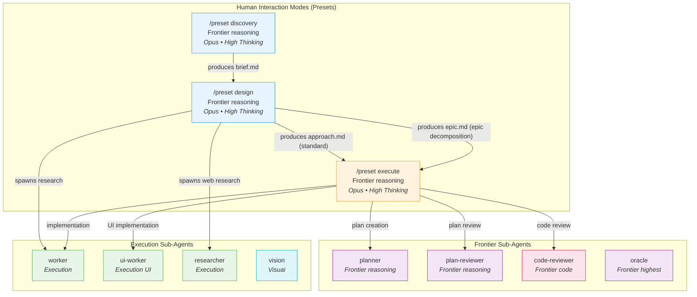
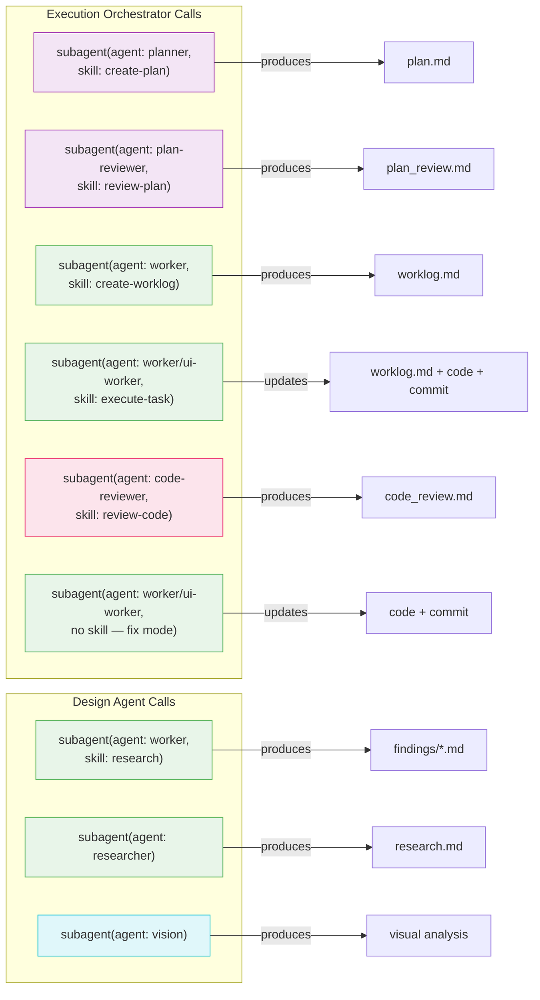
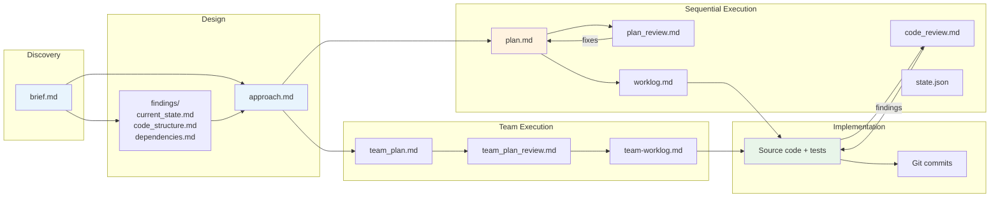
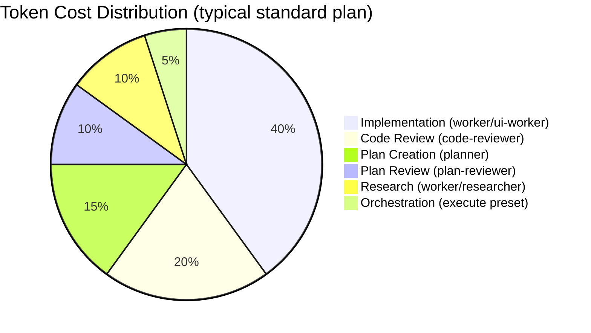
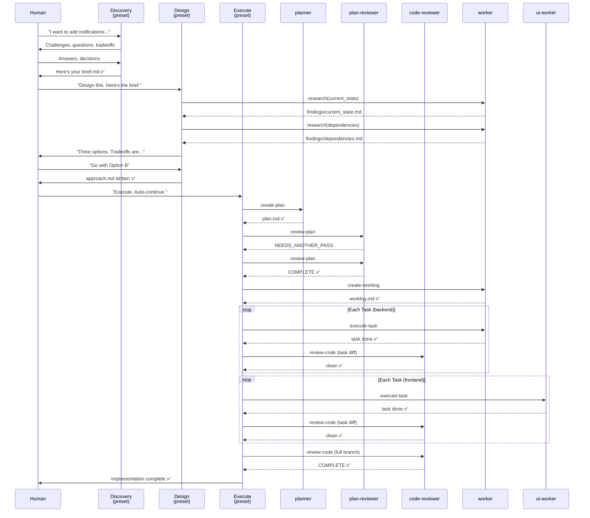

# Agent Architecture & Workflow

This document defines the three agent modes, how they interact, when sub-agents are spawned, and the complete flow from idea to implementation.

> **Harness note:** The diagrams below show the Pi roster for sequential execution. OpenCode
> also provides a separate role-based team pipeline after approach review. Category-backed
> team members run through Sisyphus-Junior with category-specific models; direct team members
> may use `sisyphus`, `atlas`, `sisyphus-junior`, or `hephaestus`. See
> [Team-Mode Execution](team-mode-execution.md) and [Skill Rendering](skill-rendering.md).

---

## System Overview

---

## Complete Process Flow

```mermaid
flowchart TD
    %% Discovery Phase
    subgraph DISCOVERY["🔍 DISCOVERY — /preset discovery"]
        direction TB
        D1[Human has idea/problem]
        D2[Discovery Agent challenges assumptions<br/>surfaces tradeoffs, identifies blind spots]
        D3[Determine plan level<br/>simple / standard / epic]
        D4["✅ Produce brief.md"]
        D1 --> D2 --> D3 --> D4
    end

    %% Design Phase
    subgraph DESIGN["🎨 DESIGN — /preset design"]
        direction TB
        DE1[Read brief.md]
        DE2[Propose research topics → human confirms]
        DE3["Spawn sub-agents for research<br/><b>codebase:</b> worker + research skill<br/><b>web:</b> researcher<br/><b>visual:</b> vision<br/><b>output:</b> findings/*.md"]
        DE4[Synthesize findings]
        DE5[Present design options + tradeoffs<br/>→ human decides]
        DE6["✅ Produce approach.md"]
        DE7["✅ For epics: produce epic.md\n(workstreams + child plans)"]
        DE1 --> DE2 --> DE3 --> DE4 --> DE5 --> DE6 --> DE7
    end

    %% Sequential Execution Phase
    subgraph EXECUTION["⚡ SEQUENTIAL EXECUTION — /preset execute"]
        direction TB

        %% Plan Creation
        E1["<b>Create Plan</b><br/>agent: planner<br/>skill: create-plan<br/>output: plan.md"]

        %% Plan Review Loop
        E2["<b>Review Plan</b><br/>agent: plan-reviewer<br/>skill: review-plan<br/>output: plan_review.md"]
        E2check{COMPLETE?}
        E2 --> E2check
        E2check -->|No, max 5x| E2

        %% Approval Gate
        E3{"🛑 APPROVAL GATE<br/>(skip if auto-continue)"}

        %% Worklog
        E4["<b>Create Worklog</b><br/>agent: worker<br/>skill: create-worklog<br/>output: worklog.md"]

        %% Task Execution Loop
        E5["<b>Execute Task N</b><br/>agent: worker or ui-worker<br/>skill: execute-task<br/>reads: worklog.md"]
        E5review["<b>Per-Task Review</b> (optional)<br/>agent: code-reviewer<br/>skill: review-code"]
        E5fix["<b>Fix Issues</b><br/>agent: worker or ui-worker<br/>max 2x per task"]
        E5check{More tasks?}

        E5 --> E5review
        E5review -->|issues| E5fix --> E5review
        E5review -->|clean| E5check
        E5check -->|Yes| E5

        %% Final Code Review
        E6["<b>Final Code Review</b><br/>agent: code-reviewer<br/>skill: review-code<br/>scope: full branch diff"]
        E6fix["<b>Fix Issues</b><br/>agent: worker or ui-worker"]
        E6check{COMPLETE?}
        E6 --> E6check
        E6check -->|No, max 5x| E6fix --> E6

        %% Done
        E7["✅ Complete<br/>state.json → complete"]

        E1 --> E2
        E2check -->|Yes| E3
        E3 -->|Approved| E4
        E4 --> E5
        E5check -->|No| E6
        E6check -->|Yes| E7
    end

    subgraph TEAM["⚡ TEAM EXECUTION — OpenCode"]
        direction TB
        T1[Create team_plan.md from reviewed approach]
        T2[Review team_plan.md]
        T3[Contracts + fast implementers]
        T4[Live review + remediation + rescue]
        T5[Lead gates + integration commits]
        T6[Close team + fresh strong final review]
        T1 --> T2 --> T3 --> T4 --> T5 --> T6
    end

    %% Connections between phases
    DISCOVERY -->|"brief.md written<br/>Human starts Design"| DESIGN
    DESIGN -->|"standard: approach.md written<br/>Human switches to Execute"| EXECUTION
    DESIGN -->|"team mode selected after reviewed approach"| TEAM
    DESIGN -->|"epic: approach.md + epic.md + epic_review.md written<br/>Human switches to Execute child plans"| EXECUTION
```

---

## Sub-Agent Call Reference

---

## Artifact Flow

---

## Model & Cost Allocation

| Agent | Model Tier | Role | Cost Tier |
|-------|-----------|------|-----------|
| Discovery preset | Frontier (reasoning) | Interactive challenge mode | High (but brief sessions) |
| Design preset | Frontier (reasoning) | Interactive + research delegation | High (medium sessions) |
| Execute preset | Frontier (reasoning) | Orchestration (no implementation) | High (low token use) |
| planner | Frontier (reasoning) | Plan creation | High (one-shot) |
| plan-reviewer | Frontier (reasoning) | Plan quality gate | High (moderate, iterative) |
| code-reviewer | Frontier (code) | Code quality gate | High (moderate, iterative) |
| worker | Execution | Backend implementation | Medium (highest volume) |
| ui-worker | Execution (UI) | Frontend implementation | Medium (high volume for UI work) |
| researcher | Execution | Web/external research | Medium (low volume) |
| vision | Visual | Screenshot/mockup analysis | Medium (low volume) |
| oracle | Frontier (highest) | Read-only second opinion | High (rare, deep) |

---

## Three Agent Modes — Comparison

| | Discovery | Design | Execution |
|---|---|---|---|
| **Invocation** | `/preset discovery` | `/preset design` | `/preset execute` |
| **Human interaction** | High — dialogue | Medium — approve decisions | Low — approval gate only |
| **Personality** | Socratic, challenging | Collaborative, structured | Autonomous, systematic |
| **Spawns sub-agents?** | No | Yes (worker, researcher, vision) | Yes (all agents) |
| **Produces** | brief.md | standard: findings/ + approach.md epic: findings/ + approach.md + epic.md + epic_review.md | plan → code → review |
| **Model** | Frontier (reasoning) | Frontier (reasoning) | Frontier (reasoning) + delegates to all tiers |
| **Tools** | read, bash | read, bash, edit, write, subagent, web_search | read, bash, edit, write, subagent |
| **Duration** | Minutes | 10-30 min | 30 min - hours |

---

## Handoff Between Modes

The modes are explicitly separated. Each produces artifacts that serve as input for the next:

