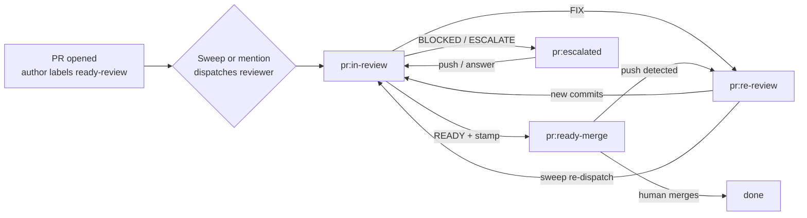

# PR Automation for Agent Owners

How a Hermes agent that owns one or more repos detects PRs awaiting review,
dispatches the review, keeps label state truthful, and routes notifications.
The review itself — what to check and how to judge it — is the
[pull-request skill's Reviewer role](../../skills/pull-request/SKILL.md)
executing the [PR review process](../references/pr-review.md). This document
is only the logistics around it.

---

## Label state machine

Labels plus `reviewed@<sha>` comments are the system of record. They survive
agent restarts, and every sweep tick reconstructs state from them
statelessly — no agent-side memory is required.

| Label | Meaning | Set by |
|-------|---------|--------|
| `pr:ready-review` | Awaiting first review | Author, when opening the PR |
| `pr:in-review` | A reviewer is actively working it | Reviewer, on start |
| `pr:re-review` | New commits or comments since the last `reviewed@` stamp | Reviewer on FIX verdict, or automation on push |
| `pr:ready-merge` | Reviewer posted READY + stamp; human decision pending | Reviewer |
| `pr:escalated` | BLOCKED verdict or an ESCALATE question is pending | Reviewer |

Transitions:



Label drift (a PR in a wrong or missing state) is corrected by the sweep,
never by alerting the human — except drift on `pr:ready-merge` (see failure
policy).

---

## Triggers

Three trigger surfaces, in priority order:

1. **Cron sweep (backbone).** One scheduled job per owning agent covering
   all owned repos. Interval: every 1–2 minutes. With the monitor guard
   (below), idle ticks cost zero LLM tokens and stay far inside GitHub API
   rate limits.
2. **Comment mentions.** A human comment containing the agent's handle
   (`@<agent> review` / `@<agent> fix`) triggers immediately. The handle is
   per-repo configuration, recorded in the repo's `pr-tracking` manifest
   row. Mentions always win over sweep state — a mention forces a run even
   if labels look stale.
3. **Push demotion.** A new commit on a PR labeled `pr:ready-merge`,
   `pr:escalated`, or past a `reviewed@` stamp moves it to `pr:re-review`
   (labels updated mechanically; no LLM needed). This closes the
   silent-stale-approval hole: a stamped READY whose branch moved is not
   mergeable advice.

Webhook-triggered instant dispatch is the eventual upgrade and is
deliberately deferred: the sweep architecture below is intentionally
webhook-shaped so the monitor script can be reused as the webhook payload
handler later.

---

## Monitor guard: no LLM on idle ticks

The sweep cron uses a Hermes `monitor_script`. Each tick the script runs
first; its output is hashed as exact bytes. **Unchanged output = silent
`no_change` tick: no LLM, no delivery, zero tokens. Changed output = the
diff is injected into a normal agent run.**

The script queries GitHub (read-only) and prints a sorted, deterministic
summary of actionable PR state per repo:

```
repo: <owner>/<repo>
  pr:<number> label=<label> head=<sha> stamp=<sha-or-none> comments-new=<n>
```

Rules for the script:

- **Byte-stable output**: fixed line format, sorted by repo then PR number,
  no timestamps, no counts of things that jitter (e.g. do not include
  "seconds since last run").
- **Actionable means actionable**: include a PR when (a) its label is
  `pr:ready-review` or `pr:re-review`, or (b) its head SHA differs from the
  last stamped SHA and its label is not `pr:in-review`, or (c) a new comment
  mentions the agent. Do NOT include `pr:in-review` PRs the agent itself is
  already working (the dispatch record below covers that) or
  `pr:ready-merge` PRs whose stamp matches HEAD and have no new comments —
  those would re-fire the LLM every tick until the human merges.
- **Detect its own actions as calm, not change**: after the agent reviews a
  PR, the resulting label + stamp change produces one changed hash (the
  triggering tick) and then stability. If the output would flap, the script
  is wrong — fix the script, do not widen the agent's job.

Reference implementation lives at `scripts/pr-sweep-monitor.mjs` (Node,
GitHub REST via `gh` or token, repos passed as an env var). Keep it
deterministic; it is infrastructure, not judgment.

---

## Dispatch: the tick never reviews inline

Hermes cron agent runs are hard-interrupted at 3 minutes. A real review —
checkout, rule pass, verification commands — does not fit. Therefore:

- The sweep tick's only job: parse the injected change summary, then
  **dispatch one background review task per actionable PR** (delegation or
  spawned process), each running the pull-request skill's Reviewer role
  with the PR number, repo, and the repo's manifest path as inputs.
- **One dispatch record per tick**, written before spawning
  (e.g. `~/.../pr-automation/dispatches.jsonl`: timestamp, repo, PR, head
  SHA). The record is what makes re-dispatches idempotent — a PR already
  dispatched at a given head SHA is skipped even if the monitor output
  changes again.
- **Reviews may take arbitrarily long** — they run outside the cron tick.
  The next sweep sees their label/stamp effects, not their runtime.

---

## Failure policy

- **Never half-post.** A reviewer that dies mid-run (provider timeout,
  iteration cap) must not leave a partial review comment or a label it did
  not earn. Post-verify after any dispatch failure: if the agent's working
  note says it posted, confirm the comment exists before trusting the
  label; on mismatch, remove the label and let the sweep re-dispatch.
- **Retry on next tick.** A failed dispatch is simply retried by the next
  sweep (the dispatch record prevents double-dispatch at the same head SHA;
  a new SHA always re-fires).
- **Escalate stuck states.** A PR in `pr:in-review` across more than one
  sweep with no progress, or repeated dispatch failure at the same SHA
  (3+ times), is reported to the human as an automation failure — not
  silently retried forever.
- **Notify the human only on**: READY digests (per the loop rules in the
  PR review process), BLOCKED/ESCALATE questions, label drift on
  `pr:ready-merge`, and stuck states. FIX loops stay silent (bounded at
  two, per the process).

---

## Boundaries

- **Agents never merge.** `pr:ready-merge` is a human decision surface. The
  agent's READY digest is the full case for merging; the human merges (or
  asks the agent to, explicitly, case by case).
- **The sweep is an accelererator, not a reviewer of record.** Verdicts come
  only from a properly dispatched independent reviewer run. Automation
  never stamps `reviewed@<sha>` itself.
- **Base-branch hygiene.** Never `--delete-branch` a merge while other open
  PRs use that branch as base (GitHub auto-closes them, unreopenably).
  Sweep merges — if the human delegates any — must re-target dependents
  first.
- **Canonical policy wins.** If logistics here ever conflict with
  [pr-review.md](../references/pr-review.md), pr-review.md wins; fix this
  doc.

---

## Sweep cron template

Copy per owning agent; fill the three uppercase fields. The prompt inlines
only logistics — the process contract is read from the repo at run time.

```
Schedule: every 1m (or 2m)
Monitor script: scripts/pr-sweep-monitor.mjs   (packaged via skill-resources
                into the agent's tree, or referenced from a local checkout)
Script env:    PR_SWEEP_REPOS="owner/repo-a owner/repo-b"
               GH_TOKEN via the agent's existing auth
Prompt: |
  You are the PR-logistics sweep for repos: $PR_SWEEP_REPOS.
  The MONITOR CHANGE DETECTED block lists actionable PRs.
  For each PR listed:
    1. Read docs/hermes/pr-automation.md and docs/references/pr-review.md
       in the repo (local checkout under the agent's repos/ directory;
       fetch first).
    2. Check the dispatch record; skip PRs already dispatched at this head SHA.
    3. Set label pr:in-review, then dispatch ONE background reviewer task
       running the pull-request skill's Reviewer role
       (repo, PR number, manifest path as inputs).
    4. Append the dispatch record.
  Do not review inline. Do not post comments yourself. Do not merge.
  Report only failures and stuck states.
```

Setup is step 2 of the [self-setup checklist](README.md#agent-self-setup-checklist).
