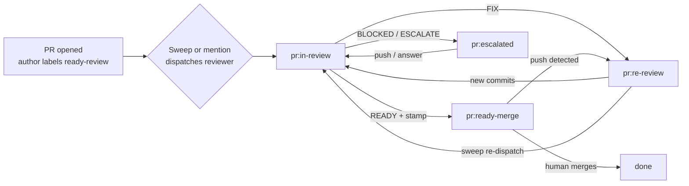

# PR Automation for Agent Owners

How a Hermes agent that owns one or more repos detects PRs awaiting review,
dispatches the review, keeps label state truthful, and routes notifications.
The review itself — what to check and how to judge it — is the
[pull-request skill's Reviewer role](../../skills/pull-request/SKILL.md)
executing the [PR review process](../references/pr-review.md). This document
is only the logistics around it.

---

## Label state machine

Labels plus `reviewed@<sha>` comments are the system of record. They survive
agent restarts, and every sweep tick reconstructs state from them
statelessly — no agent-side memory is required.

| Label | Meaning | Set by |
|-------|---------|--------|
| `pr:ready-review` | Awaiting first review | Author, when opening the PR |
| `pr:in-review` | A reviewer is actively working it | Reviewer, on start |
| `pr:re-review` | New commits or comments since the last `reviewed@` stamp | Reviewer on FIX verdict, or automation on push |
| `pr:ready-merge` | Reviewer posted READY + stamp; human decision pending | Reviewer |
| `pr:escalated` | BLOCKED verdict or an ESCALATE question is pending | Reviewer |

One **ownership label** sits alongside the state labels. It never replaces them:

| Label | Meaning | Set by |
|-------|---------|--------|
| `pr:babysat` | An author-side babysit session owns the fix loop (see [Babysit coexistence](#babysit-coexistence)) | The babysit session, on start; removed by it on exit, or by the sweep when the claim goes stale |

Transitions:


```mermaid
flowchart LR
  O[PR opened<br/>author labels ready-review] --> R{Sweep or mention<br/>dispatches reviewer}
  R --> IR[pr:in-review]
  IR -->|READY + stamp| RM[pr:ready-merge]
  IR -->|FIX| RR[pr:re-review]
  IR -->|BLOCKED / ESCALATE| ES[pr:escalated]
  RR -->|new commits| IR
  RR -->|sweep re-dispatch| IR
  RM -->|push detected| RR
  ES -->|push / answer| IR
  RM -->|human merges| D[done]
```

Label drift (a PR in a wrong or missing state) is corrected by the sweep,
never by alerting the human — except drift on `pr:ready-merge` (see failure
policy).

---

## Triggers

Four trigger surfaces, in priority order:

1. **Cron sweep (backbone).** One scheduled job per owning agent covering
   all owned repos. Interval: every 1–2 minutes. The tick is a no-agent
   script (see [The sweep tick](#the-sweep-tick-no-llm)), so every tick
   costs zero LLM tokens and stays far inside GitHub API rate limits.
2. **Comment mentions.** A human comment containing the agent's handle
   triggers on the next tick: `@<agent> review` (or any other mention)
   dispatches a Reviewer; `@<agent> fix` / `@<agent> babysit` starts an
   author-side round (trigger 4). The handle is
   per-repo configuration, recorded in the repo's `pr-tracking` manifest
   row. Mentions always win over sweep state — a mention forces a run even
   if labels look stale.
3. **Push demotion.** A new commit on a PR labeled `pr:ready-merge`,
   `pr:escalated`, or past a `reviewed@` stamp moves it to `pr:re-review`
   (labels updated mechanically; no LLM needed). This closes the
   silent-stale-approval hole: a stamped READY whose branch moved is not
   mergeable advice.
4. **Babysit mention.** `@<agent> babysit` on a PR starts an author-side
   babysit session for it (the `babysit-pr` skill), the same as asking in
   chat. The sweep dispatches the session; it does not babysit inline.

Webhook-triggered instant dispatch is the eventual upgrade and is
deliberately deferred. The dispatcher's per-PR decision is a pure function of
the PR's labels and comments, so a webhook handler can call the same logic
for one PR instead of sweeping them all.

---

## Babysit coexistence

The sweep and babysitting are two different jobs, and both are needed:

| | Sweep | Babysit |
|---|---|---|
| Started by | Labels, mentions, pushes (always on) | A human asks: chat or `@<agent> babysit`, or the author's sweep-owned claim at PR open under the delivery pipeline ([rule 7](#rules-that-let-them-run-on-the-same-pr-without-fighting)) |
| Lifetime | Persistent cron | Until READY, PR closed, human stop, escalation, or session end |
| Role | Reviewer logistics: dispatch independent reviews, keep labels truthful | Author: fix findings, reply, push, request re-review |
| Never does | Fix code | Issue a verdict or stamp on its own work |

Rules that let them run on the same PR without fighting:

1. **Claim.** A babysit session adds `pr:babysat` and posts one claim comment,
   `babysit: session=<id> heartbeat=<iso-time>`. It edits that same comment's
   heartbeat on every round it processes (it does not post a new one). On exit
   it removes the label and edits the comment to `babysit: released`.
2. **What the sweep still does on a babysat PR:** dispatches independent
   Reviewer runs (push demotion to `pr:re-review` works as usual), corrects
   label drift, and reports stuck states.
3. **What the sweep stops doing on a babysat PR:** dispatching any fix or
   author-side work, and notifying the human about FIX verdicts. The babysitter
   owns those. READY, BLOCKED, and ESCALATE still notify the human.
4. **Handoff.** Babysitter pushes a fix, push demotion sets `pr:re-review`, the
   sweep dispatches a fresh Reviewer, and the Reviewer's verdict comment wakes
   the babysitter. The babysitter therefore watches for new verdict/`reviewed@`
   comments and human comments, not just bot reviews.
5. **Shared bound.** The two-fix-loop limit from the
   [PR review process](../references/pr-review.md) is counted from the PR's
   FIX verdict history, not per session. A babysitter that reaches it
   escalates. Being asked to babysit does not raise the bound.
6. **Stale claim.** If the heartbeat is older than `PR_BABYSIT_STALE_MIN`
   (default 60 minutes), the claim is stale. The sweep then
   removes `pr:babysat`, treats the PR as a stuck state, and notifies the human
   once. The PR then falls back to normal sweep handling.
7. **Babysit on open.** Under the [Delivery Pipeline](../references/delivery-pipeline.md#4-pr-lifecycle),
   the author posts a sweep-owned claim (`session=babysit-pr…`) when opening
   the PR, so babysitting starts without a mention. For sweep-owned claims the
   sweep dispatches one round per new FIX verdict at the current head, one
   round per new completed bot review (e.g. Copilot) while the PR's bot-review
   count is under the cap (**5 per PR**, `PR_BOT_REVIEW_CAP`; bot login(s) in
   `PR_BOT_REVIEWERS`), and one round per CI red→green transition at the
   stamped READY head (the author keeps required checks green; green again
   restores `pr:ready-merge`). The round fires with or without an active
   claim — the round posts its own claim; chat-started claims still get no
   twin. Bot reviews never count toward the fix-loop bound; neither do CI
   maintenance rounds.
   Sweep-owned claims are not aged by heartbeat (rule 6 applies to
   chat-started claims only): between rounds nobody is running, by design.
8. **Who owns the round loop.** A babysitter started from chat runs its own
   one-shot watcher, and the sweep must not start a twin. A babysit started by
   the sweep (`@<agent> babysit`) has no watcher: the sweep re-dispatches one
   round per new FIX verdict at the current head. Sweep-started sessions use
   a reserved session-id prefix in the claim (`session=babysit-pr…`), and
   the sweep only continues claims carrying that prefix.

---

## The sweep tick (no LLM)

The tick is a Hermes cron job in `no_agent` mode: a deterministic script,
[`scripts/pr-sweep-dispatch.py`](../../scripts/pr-sweep-dispatch.py). It reads
GitHub and applies the rules below. Its stdout is the delivery; empty stdout
means a silent tick. The tick exercises no judgment: it decides who works on
a PR, never what the verdict is. So an LLM adds cost and a failure mode (a
model that "just checks" and starts reviewing inside a 3-minute tick) and no
value.

Per PR, each tick:

- **Reads state** from labels and comments only. There is no agent-side
  memory beyond the dispatch record: the one state label, the latest verdict
  marker, the babysit claim heartbeat, and unprocessed handle mentions.
- **Selects work.** A Reviewer is wanted when the label is `pr:ready-review`
  or `pr:re-review` with no finished review at this head, when there is an
  unprocessed review mention, or when the PR is `pr:in-review` but no
  reviewer is running (drift). An author round is wanted on a babysit/fix
  mention with no claim, or on a new FIX verdict at the current head under a
  sweep-owned claim. Drafts are skipped. `pr:ready-merge` PRs whose verdict
  head equals the PR head are left alone until the human merges.
- **Demotes pushes mechanically.** `pr:ready-merge` or `pr:escalated` whose
  latest verdict head is not the PR head moves to `pr:re-review`. A stale
  READY is reported.
- **Handles claims.** A stale claim loses `pr:babysat` and is reported once.
- **Detects its own actions as calm.** After a reviewer posts, the next tick
  sees a finished review at this head and does nothing. If a PR re-dispatches
  every tick, the rules are wrong: fix the script, do not widen a session's
  job.

## Dispatch: the tick never reviews inline

Hermes cron agent runs are hard-interrupted at 3 minutes. A real review —
checkout, rule pass, verification commands — does not fit. Therefore:

- The sweep tick's only job: **dispatch one background review task per
  actionable PR**, each running
  the pull-request skill's Reviewer role with the PR number, repo, and the
  repo's manifest path as inputs.
- **The vehicle is a detached Hermes session**, not in-process delegation.
  A `delegate_task` child lives inside the tick's process and dies with it.
  Launch a separate process instead:
  `hermes chat -Q --oneshot --query-file <prompt> --source pr-automation
  --continue "<title>" --create-if-missing -m <model> -s <skills>`, started
  with a new session (`setsid` / `start_new_session`) and stdin closed. The
  session is re-parented to init and outlives the tick. Use a strong model
  for the Reviewer (it produces the verdict of record) and a cheaper one for
  author-side babysit rounds.
- **Name the session** `PR #<n> <review|babysit> @<sha7> — <PR title>` at
  launch (`--continue <title> --create-if-missing`). The Reviewer renames it
  to end with its verdict when done. Otherwise one-shot sessions get
  auto-titles such as `<command_output>` or the prompt's first words, and
  are indistinguishable in the session list.
- **Result file.** Each session writes
  `pr-automation/results/<tag>.json` (`pr`, `head`, `verdict`/`status`,
  `summary`, `url`, `notify`). A later tick delivers it as the READY /
  BLOCKED / ESCALATE digest. A dispatch whose process is gone without a
  result file counts as a failed dispatch.
- **One dispatch record per tick**, written before spawning
  (e.g. `~/.../pr-automation/dispatches.jsonl`: timestamp, repo, PR, head
  SHA, session tag, pid). The record makes re-dispatches idempotent: a PR
  with a finished or running review at a given head SHA is not dispatched
  again, and each mention comment is processed once.
- **Reviews may take arbitrarily long** — they run outside the cron tick.
  The next sweep sees their label/stamp effects, not their runtime.

---

## Verdict marker

Reviewer comments end with a machine-readable marker so the sweep can parse
state without an LLM:

```
**Verdict: READY|FIX|BLOCKED**
<!-- pr-review verdict=READY|FIX|BLOCKED head=<full sha> -->
reviewed@<full sha>          (READY only)
```

The sweep uses the marker for push demotion (a verdict whose `head` differs
from the PR head is stale), for the shared two-fix-loop bound (count of
`verdict=FIX` markers), and for babysit hand-off (a new FIX marker at the
current head triggers the next babysit round).

---

## Failure policy

- **Never half-post.** A reviewer that dies mid-run (provider timeout,
  iteration cap) must not leave a partial review comment or a label it did
  not earn. Post-verify after any dispatch failure: if the agent's working
  note says it posted, confirm the comment exists before trusting the
  label; on mismatch, remove the label and let the sweep re-dispatch.
- **Retry on next tick.** A failed dispatch is simply retried by the next
  sweep (the dispatch record prevents double-dispatch at the same head SHA;
  a new SHA always re-fires).
- **Escalate stuck states.** A PR in `pr:in-review` across more than one
  sweep with no progress, or repeated dispatch failure at the same SHA
  (3+ times), is reported to the human as an automation failure — not
  silently retried forever.
- **Notify the human only on**: stale babysit claims, READY digests (per the loop rules in the
  PR review process), BLOCKED/ESCALATE questions, label drift on
  `pr:ready-merge`, and stuck states. FIX loops stay silent (bounded at
  two, per the process).

---

## Boundaries

- **Agents never merge.** `pr:ready-merge` is a human decision surface. The
  agent's READY digest is the full case for merging; the human merges (or
  asks the agent to, explicitly, case by case).
- **The sweep is an accelererator, not a reviewer of record.** Verdicts come
  only from a properly dispatched independent reviewer run. Automation
  never stamps `reviewed@<sha>` itself.
- **Base-branch hygiene.** Never `--delete-branch` a merge while other open
  PRs use that branch as base (GitHub auto-closes them, unreopenably).
  Sweep merges — if the human delegates any — must re-target dependents
  first.
- **Canonical policy wins.** If logistics here ever conflict with
  [pr-review.md](../references/pr-review.md), pr-review.md wins; fix this
  doc.

---

## Sweep cron template

Copy per owning agent. Everything the tick does is in the script; the process
contract is read from the repo by the sessions it launches.

```
hermes cron create "every 2m" --no-agent --script pr-sweep-dispatch.py --name pr-sweep

Install:  copy scripts/pr-sweep-dispatch.py and scripts/pr-sweep-prompts/
          into $HERMES_HOME/scripts/
Env:      PR_SWEEP_REPOS="owner/repo-a owner/repo-b"   PR_AGENT_HANDLE="handle [alias ...]"
          PR_REVIEW_MODEL (strong)  PR_BABYSIT_MODEL (cheaper)
          PR_REVIEW_SKILLS / PR_BABYSIT_SKILLS (add repo overlay skills)
          PR_SWEEP_CHECKOUT_ROOT (local checkouts, default ~/repos)
          HERMES_BIN / GH_BIN / GH_TOKEN_FILE as the host needs
Deliver:  the channel where the human wants READY / BLOCKED / ESCALATE digests
```

`PR_SWEEP_DRY=1` prints the actions a tick would take without mutating GitHub
or the dispatch record. Run it once before enabling the cron. The session
prompts in `scripts/pr-sweep-prompts/` carry the logistics (worktree, exactly
one comment, verdict marker, labels via REST, result file, session title). The
review itself is the `pull-request` skill executing
`docs/references/pr-review.md`, read from the repo at run time and never
restated in the prompt.

### Opt-in vs drift

By default an unlabeled PR is **ignored** until someone labels it
`pr:ready-review` or mentions the handle. Otherwise, in a repo with open PRs,
the first tick would queue every one of them for review. Set
`PR_SWEEP_UNLABELED=review` to treat an unlabeled PR as drift awaiting review.

Setup is step 2 of the [self-setup checklist](README.md#agent-self-setup-checklist).
